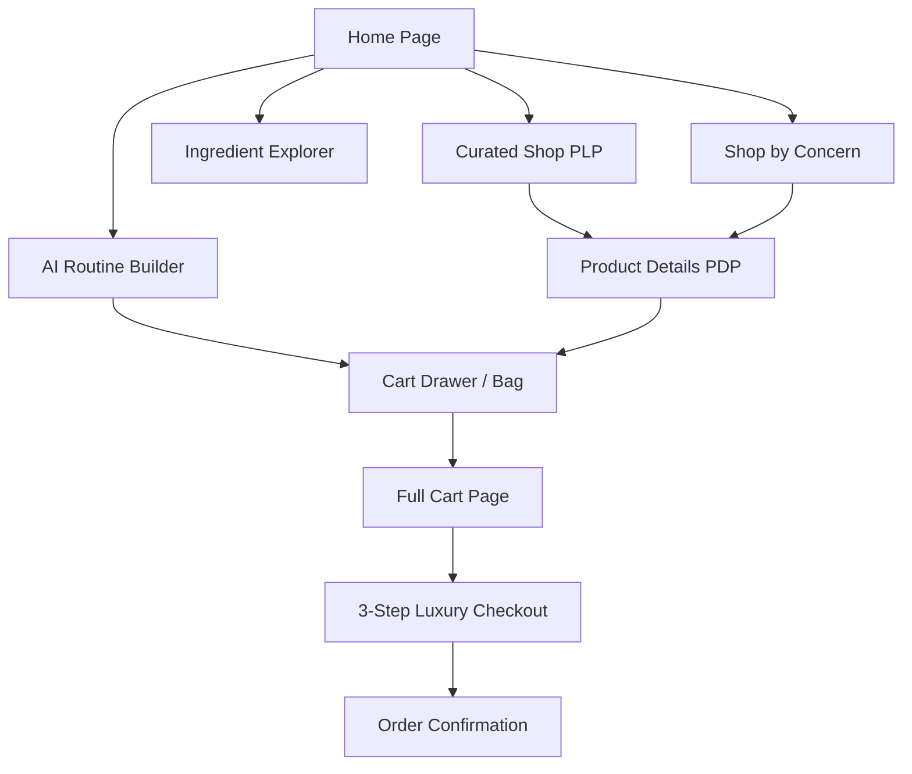

# Élanor — Frontend Product Requirements Document (PRD) v1.0

> **Document Version:** 1.0.0  
> **Product Name:** Élanor  
> **Brand Slogan:** Pure Beauty. Naturally.  
> **Philosophy:** Haute Botanique & Clinical Cellular Longevity  
> **Target Release:** Q4 2026  
> **Author:** Antigravity Engineering & Design Team  

---

## 1. Executive Summary & Vision

**Élanor** is an ultra-premium, quiet-luxury skincare digital platform. It synthesizes rare wild-harvested French and Swiss alpine botanicals with breakthrough clinical biotechnology (lipid-identical ceramides, encapsulated retinaldehyde, multi-tier hyaluronic matrices).

The frontend experience is engineered to evoke an editorial sensory ritual: gentle fluid typography, soft warm-beige and cream canvas, marble pedestal product staging, frictionless predictive search, an interactive 4-step AI Routine Builder, and a streamlined 3-step luxury checkout.

---

## 2. Target User Personas

| Persona | Demographics & Mindset | Core Needs & Pain Points | Key Platform Touchpoints |
|---|---|---|---|
| **The Connoisseur of Clean Luxury** | Age 28–48, urban professional, values organic certification and aesthetic prestige. | Skeptical of synthetic additives; desires clinical proof alongside sensory indulgence. | Ingredient Explorer, Double-Blind Clinical Dossiers, Miron Glass Story. |
| **The Sensitive Skin Ritualist** | Reactive/compromised barrier, prone to redness and seasonal dryness. | Fears harsh irritation from synthetic retinoids and artificial fragrances. | Shop by Concern (Barrier Repair & Calming), 5-Ceramide Velvet Cream, Hypoallergenic Badges. |
| **The Targeted Optimizer** | Values routine simplicity, high bio-availability, and results-driven skincare. | Overwhelmed by 10-step regimens; wants scientifically paired morning/evening sequences. | AI Routine Builder Quiz, Formula Comparator Matrix, 1-Click Routine Bundles. |

---

## 3. Technology Stack & Technical Constraints

| Architecture Layer | Technology | Specifications & Rationale |
|---|---|---|
| **Framework** | Next.js 15+ (App Router) | High-performance React 19 server/client hybrid architecture with nested layouts and route prefetching. |
| **Language** | TypeScript 5.8+ | Strict type safety across product models, skin concern taxonomies, and cart state machines. |
| **Styling** | Tailwind CSS v4 | Native CSS variable design token engine with zero runtime CSS overhead. |
| **Motion & Scroll** | GSAP 3 + ScrollTrigger + Lenis | Studio Freight Lenis physics-based inertial smooth scrolling synced with GSAP tick loop. |
| **Icons** | Lucide React | 1.75px monoline stroke iconography styled with luxury `#1B1A17` and `#C8A46A` brand accents. |
| **Asset Pipeline** | Next.js Image Component | Responsive image optimization with marble pedestal composition. |

---

## 4. Design System Tokens & Aesthetic Guidelines

### 4.1 Color System
- **Primary Canvas (`--bg-primary`):** `#F8F3EB` (Soft Warm Beige)
- **Secondary Canvas (`--bg-secondary`):** `#F2EBE2` (Muted Sand)
- **Elevated Surfaces (`--bg-card`):** `#FFFDF9` (Luminescent Cream)
- **Glassmorphism (`--bg-glass`):** `rgba(255, 253, 249, 0.75)` with `backdrop-filter: blur(20px)`
- **Brand Gold Accent (`--brand-gold`):** `#C8A46A`
- **Brand Gold Light (`--brand-gold-light`):** `#E4C894`
- **Botanical Sage (`--brand-sage`):** `#7D9075`
- **Primary Text (`--text-primary`):** `#1B1A17`
- **Secondary Text (`--text-secondary`):** `#5E584F`
- **Muted Text (`--text-muted`):** `#8E857A`

### 4.2 Typography Hierarchy
- **Serif Display (Headings):** `Cormorant Garamond` (Weights: 400, 500, 600) — Tracking: `-0.025em` to `-0.04em`
- **Sans Interface & Body:** `Manrope` (Weights: 300, 400, 500, 600) — Tracking: `0` to `0.04em`

### 4.3 Elevation & Spatial Rules
- **Spacing Grid:** Strictly adheres to an 8px spatial rhythm (`8px`, `16px`, `24px`, `32px`, `48px`, `64px`).
- **Shadows:** Soft diffuse elevation (`0 10px 35px rgba(0, 0, 0, 0.06)` and `0 30px 80px rgba(41, 27, 12, 0.12)`).

---

## 5. Screen Specifications & Functional Requirements

### 5.1 Screen 1: Editorial Home (`/`)
1. **Hero Section**:
   - Official brand visual ([`skin7.png`](file:///e:/Elanor/public/images/skin7.png)) centered in a 3:2 aspect canvas with floating physics and ambient glow.
   - GSAP reveal animation for headline: *"Where Rare Botany Meets Clinical Rigor."*
   - Micro-badges showcasing **"Pure Beauty. Naturally."** and **"100% Bio-Identical"**.
2. **Editorial Marquee**: Infinite smooth scroll banner highlighting wild-harvested damask rose, alpine edelweiss, and liposomal retinaldehyde.
3. **Curated Masterpieces (Bestsellers)**: 3-column product grid featuring interactive hover image crossfades and quick action overlays.
4. **Targeted Dermatology (Concern Spotlight)**: Interactive cards navigating directly to specific skin concerns.
5. **AI Algorithmic Diagnostic Teaser**: Interactive preview card of the custom regimen matrix.
6. **Double-Blind Clinical Proof**: Verified statistical breakdown (`98.6%` satisfaction rate, `240` clinical subjects).

### 5.2 Screen 2: Curated Shop / PLP (`/shop`)
1. **Multi-Facet Filter Sidebar**:
   - Filter by Category (Serums, Creams, Elixirs, Cleansers, Masks, Eye Care).
   - Filter by Skin Concern (Radiance, Anti-Aging, Barrier Repair, Hydration, Calming, Clarifying).
   - Filter by Key Bio-Active (Saffron Stem Cells, Ceramides, Retinaldehyde, Peptides).
2. **Sorting Dropdown**: Featured, Price Ascending, Price Descending, Highest Clinical Rating.
3. **Quick View & Compare Actions**: Launch instant drawer for product preview or add to formula comparator.
4. **Mobile Responsive Sheet**: Slide-out filter panel for viewports `< 1024px`.
5. **Suspense Architecture**: Wrapped in `<Suspense>` to ensure zero CSR-bailout errors during static pre-rendering.

### 5.3 Screen 3: Product Details / PDP (`/product/[id]`)
1. **Visual Gallery**: Aspect 4:5 marble pedestal staging with multi-angle thumbnail switcher and zoom.
2. **Formulation Details**: Volume, sensory texture finish, skin type compatibility, key active phytomolecules.
3. **Interactive Dossier Tabs**:
   - *The Application Ritual*: Step sequence, dosage drops, lymphatic upward glide technique.
   - *Clinical Trial Dossier*: Triple-metric percentage improvements with clinical descriptions.
   - *Phytochemical Sourcing*: Full INCI breakdown with Miron violet glass preservation notes.
4. **Complete The Sacred Ritual**: Curated complementary products to build a multi-step routine.
5. **Sticky Mobile Purchase Bar**: Bottom-docked action bar displaying active price and instant "Add to Bag" on mobile devices.

### 5.4 Screen 4: AI Routine Diagnostic (`/routine-builder`)
1. **4-Step Heuristic Quiz**:
   - Step 1: Dermal Phenotype (Dry, Combination, Oily, Sensitive).
   - Step 2: Primary Priority (Radiance, Anti-Aging, Barrier Repair, Hydration).
   - Step 3: Climate & Environment (Urban, Dry Arid, Tropical, Temperate).
   - Step 4: Ritual Architecture (Minimalist 3-Step vs. Haute 5-Step).
2. **Animated Computation Engine**: Spinning gold-ring loader simulating pH optimization and bioavailability matching.
3. **Generated Regimen Output**: Side-by-side Morning Awakening & Nocturnal Metamorphosis sequence.
4. **1-Click Bundle Purchase**: "Add Complete Set" with automatic 15% bundle savings.

### 5.5 Screen 5: Ingredient Explorer (`/ingredients`)
1. **Search & Filter Engine**: Instant text search across botanical names, benefits, and origins.
2. **Phytochemical Cards**: Categorized by Cellular Botanical, Lipid Architecture, Clinical Active, and Hydration Engine.
3. **Synergy Tags**: Detailed compatibility advice (e.g. *Synergistic with Niacinamide and Peptides*).

### 5.6 Screen 6: Formula Comparator Matrix (`/compare`)
1. Side-by-side comparison table for up to 3 formulations.
2. Compares: Primary Concern, Sensory Finish, Active Bio-Molecules, Clinical Measurement, and Volume/Vessel.
3. Instant addition/removal and single-click cart insertion.

### 5.7 Screen 7: Shop by Concern (`/concern/[slug]`)
1. Dedicated dynamic landing pages for:
   - `/concern/radiance` (Cellular Luminescence)
   - `/concern/anti-aging` (Longevity & Firming)
   - `/concern/barrier-repair` (Lipid Rebuilding)
   - `/concern/hydration` (Deep Quenching)
   - `/concern/calming` (Anti-Redness)
   - `/concern/clarifying` (Pore Refining)
2. Prescribed clinical protocols with targeted formulation sets.

### 5.8 Screen 8: Maison Élanor Philosophy (`/brands`)
1. The Paris Atelier at 24 Place Vendôme.
2. Sustainable Wild-Harvesting Ethics in Grasse and Swiss Alps.
3. Biophotonic Miron Violet Glass preservation science.

### 5.9 Screen 9: Sacred Wishlist (`/wishlist`)
1. Persistent saved formulations synchronized across sessions.
2. Global "Move All to Sacred Bag" action.

### 5.10 Screen 10 & 11: Cart Drawer & Full Cart (`/cart`)
1. Real-time `$200` Free Express Shipping Progress Meter.
2. **Complimentary Deluxe Discovery Sample Picker**: Choose 1 of 3 deluxe trial droppers.
3. **Signature Gold Rigid Gift Box (+$15)**: Custom toggle with handwritten calligraphy textarea.
4. Full cart view with subtotal, tax calculation, and order summary.

### 5.11 Screen 12: 3-Step Luxury Checkout (`/checkout`)
1. **Step 1 — Sanctuary Address**: First/Last name, email, street address, city, state, postal code.
2. **Step 2 — Packaging Presentation**: Eco-Atelier Box vs. Gold Rigid Vault with Calligraphy.
3. **Step 3 — Payment Authorization**: Sandboxed card simulator with instant validation.
4. **Order Confirmation Screen**: Auto-generated order code (e.g. `ELANOR-849201`), packaging recap, destination address, and return navigation.

---

## 6. Global Navigation & Mobile-First Shell

### 6.1 Floating Glass Navbar (`Navbar.tsx`)
- Top ticker banner announcing complimentary discovery samples.
- Mega-menu dropdown with concern links, category hierarchy, and AI Routine shortcut.
- Search modal trigger, wishlist counter, and cart trigger.
- Mobile slide-out navigation drawer for tablet and phone viewports.

### 6.2 Mobile Bottom Navigation (`MobileBottomNav.tsx`)
- Fixed bottom dock (`lg:hidden`) featuring 5 primary touch-points:
  1. **Home (`/`)**
  2. **Shop (`/shop`)**
  3. **AI Ritual (`/routine-builder`)**
  4. **Wishlist (`/wishlist`)** with live count badge
  5. **Bag Drawer** with live cart item indicator

---

## 7. Quality Assurance & Acceptance Criteria

- [x] **Brand Consistency:** Product name is strictly **Élanor** across all screens, titles, metadata, and copy.
- [x] **Zero Build Errors:** Next.js static build generates all 12 routes with 100% TypeScript compliance.
- [x] **Mobile Optimization:** 100% responsive across 390px, 768px, 1024px, and 1440px+ viewports.
- [x] **Smooth Scrolling:** Lenis smooth scrolling running at 60fps with zero layout shifting.
- [x] **Commerce State Loop:** Add, update quantity, remove, select sample, toggle gift box, wishlist, and complete checkout all function with real-time UI feedback.
