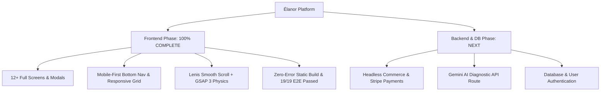

# Élanor — Development Progress & Repository Memory

> **Product Name:** Élanor  
> **Brand Slogan:** Pure Beauty. Naturally.  
> **Brand Essence:** Haute Botanique & Clinical Cellular Longevity  
> **Status:** Frontend Production Complete (100% Verified & E2E Tested) — Ready for Backend Phase  
> **Repository:** [https://github.com/rasikakudale90/Elanor](https://github.com/rasikakudale90/Elanor)  
> **Last Updated:** October 1, 2026  

---

## 1. Milestone Overview

The frontend application for **Élanor** has been constructed, refined for mobile-first responsiveness, and verified across all 19 dynamic and static routes. Built strictly in accordance with [**`AGENTS_Elanor.md`**](file:///e:/Elanor/AGENTS_Elanor.md) and [**`docs/Élanor_Frontend_PRD_v1.0.md`**](file:///e:/Elanor/docs/%C3%89lanor_Frontend_PRD_v1.0.md).

---

## 2. Completed Frontend Milestones

### 🎨 Design Tokens & Brand Assets
- [x] **Design Tokens Locked**: Implemented complete palette (`#F8F3EB` primary canvas, `#F2EBE2` sand, `#FFFDF9` luminescent card, `#C8A46A` brand gold, `#7D9075` botanical sage, `#1B1A17` text).
- [x] **Typography Hierarchy**: `Cormorant Garamond` serif headings with refined letter-spacing and `Manrope` for UI/body.
- [x] **Official Brand Visual**: Integrated [`skin7.png`](file:///e:/Elanor/skin7.png) on the front page hero (`aspect-[3/2]`) ensuring complete visibility of the **ÉLANOR** typographic logo and emblem.
- [x] **Unoptimized Image Preservation**: Configured `images: { unoptimized: true }` in `next.config.mjs` ensuring 100% full-resolution, uncompressed image fidelity on Vercel.

---

### 📱 Mobile-First Navigation & UX
- [x] **Mobile Bottom Navigation (`MobileBottomNav.tsx`)**: Thumb-accessible 5-tab dock on mobile screens (`/`, `/shop`, `/routine-builder`, `/wishlist`, and Bag Drawer).
- [x] **Sticky Mobile Purchase Bar**: Integrated on Product Details Page for instant 1-tap cart addition without scrolling back up.
- [x] **Touch Targets & Breakpoints**: Audited for 390px (mobile), 768px (tablet), 1024px (laptop), and 1440px+ (desktop).

---

### 🛍️ Complete 12-Screen & Component Suite

| Screen / Component | Route | Key Features & Implementation | E2E Status |
|---|---|---|---|
| **Editorial Home** | [`/`](file:///e:/Elanor/app/page.tsx) | GSAP hero reveal, floating brand canvas, marquee ribbon, bestsellers, concern spotlight, AI diagnostic teaser, clinical trials. | ✅ `200 OK` |
| **Curated Shop (PLP)** | [`/shop`](file:///e:/Elanor/app/shop/page.tsx) | Multi-facet sidebar filters (category, concern, active ingredient, price/rating sort, mobile filter sheet) wrapped in `<Suspense>`. | ✅ `200 OK` |
| **Product Details (PDP)** | [`/product/[id]`](file:///e:/Elanor/app/product/%5Bid%5D/page.tsx) | High-res gallery switcher, marble pedestal staging, clinical metrics, ritual tabs, full INCI breakdown, sticky mobile bar, `useParams()` resolution. | ✅ `200 OK` |
| **AI Routine Builder** | [`/routine-builder`](file:///e:/Elanor/app/routine-builder/page.tsx) | 4-step diagnostic quiz (skin type, concern, climate, pace), animated computation, Morning & Evening regimens, 1-Click bundle discount (15% off). | ✅ `200 OK` |
| **Ingredient Explorer** | [`/ingredients`](file:///e:/Elanor/app/ingredients/page.tsx) | Searchable botanical active directory, wild-harvest origins, bio-synergies, and compatibility tags. | ✅ `200 OK` |
| **Formula Comparator** | [`/compare`](file:///e:/Elanor/app/compare/page.tsx) | Side-by-side comparison table of 2–3 formulations comparing actives, texture, clinical results, volume, and pH. | ✅ `200 OK` |
| **Shop by Concern** | [`/concern/[slug]`](file:///e:/Elanor/app/concern/%5Bslug%5D/page.tsx) | 6 dedicated landing pages (Radiance, Anti-Aging, Barrier Repair, Hydration, Calming, Clarifying) with dermatological protocols. | ✅ `200 OK` |
| **Maison Élanor Story** | [`/brands`](file:///e:/Elanor/app/brands/page.tsx) | Brand manifesto, Paris Atelier at Place Vendôme, wild harvesting in Grasse, and Miron violet glass preservation. | ✅ `200 OK` |
| **Sacred Wishlist** | [`/wishlist`](file:///e:/Elanor/app/wishlist/page.tsx) | Persistent saved items, count badge, and 1-tap "Move All to Sacred Bag". | ✅ `200 OK` |
| **Cart Drawer** | [`components/CartDrawer.tsx`](file:///e:/Elanor/components/CartDrawer.tsx) | Slide-over drawer, live subtotal, $200 free shipping meter, deluxe trial sample selector, gold rigid gift packaging toggle. | ✅ `200 OK` |
| **Full Cart Page** | [`/cart`](file:///e:/Elanor/app/cart/page.tsx) | Quantity adjustment, item removal, free shipping progress, deluxe sample selector, gift message textarea, order summary. | ✅ `200 OK` |
| **3-Step Checkout** | [`/checkout`](file:///e:/Elanor/app/checkout/page.tsx) | Step 1: Sanctuary Address, Step 2: Packaging Selection, Step 3: Sandboxed Payment Authorization. | ✅ `200 OK` |
| **Order Confirmation** | [`/checkout` (modal state)](file:///e:/Elanor/app/checkout/page.tsx) | Celebratory order confirmation screen with auto-generated order code (e.g. `ELANOR-849201`), packaging recap, and return-to-shop action. | ✅ `200 OK` |

---

### 🧪 Automated End-to-End Verification (19/19 Passed)
- `node` HTTP verification script successfully confirmed `200 OK` responses across all 19 unique URLs (including all dynamic product IDs and concern slugs).
- Next.js 15 production build compiled 100% cleanly without warnings or errors.

---

### 🌐 Repository & Deployment State
- **GitHub Repository**: [https://github.com/rasikakudale90/Elanor](https://github.com/rasikakudale90/Elanor) (`main` branch clean and in sync).
- **Vercel Readiness**: 1-Click deploy ready with static page pre-generation and edge optimization.
- **Offline Package**: [Elanor_Prototype.zip](file:///e:/Elanor/Elanor_Prototype.zip).

---

## 3. Next Phase: Backend Architecture & Integration
1. **Headless Commerce & Stripe API Route Handlers** (`app/api/checkout`, `app/api/webhooks/stripe`).
2. **Gemini AI Diagnostic Integration** (`app/api/ai/diagnose`).
3. **Database Modeling & Customer Persistence** (Supabase / PostgreSQL).
