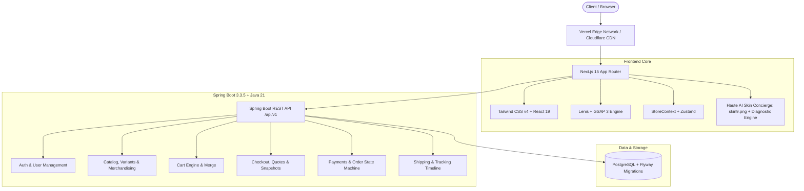

# Élanor — Technical Depth & Production Engineering Roadmap

> **System:** Élanor Luxury E-Commerce Platform  
> **Architecture Pattern:** Modular Monolith with Replaceable Provider Ports + Next.js 15 App Router  
> **Document Purpose:** Architecture blueprint, technical depth analysis, and production engineering roadmap for transition from prototype to production.

---

## 1. System Architecture Overview

---

## 2. Technical Depth & Engineering Workstreams

### 2.1 Backend Architecture & Provider Ports
* **Current State:** 
  - Modular monolith in Spring Boot 3.3.5 with 25 normalized tables via Flyway (`V1__init_schema.sql`).
  - Implemented provider port architecture: `PaymentProvider` (`DemoPaymentProvider`, `CodPaymentProvider`), `SmsProvider` (`DevLogSmsProvider`), and `SocialAuthProvider` (`GoogleAuthProvider`).
  - Phases 1 through 8 complete with 37/37 passing automated tests.
* **Production Requirements:**
  1. **Logistics Integration (Phase 9)**:
     - Implement `ShippingProvider` interface with `ManualShippingProvider` and future `ShiprocketShippingProvider`.
     - Real-time shipment timeline event tracking (`ShipmentEvent`).
  2. **Returns & Refunds (Phase 10)**:
     - 7-day return policy enforcement, admin inspection workflow, and automatic inventory restock.
  3. **Payment Gateways (Phase 15)**:
     - Plug-in live **Razorpay** and **Stripe** gateway adapters without modifying customer-facing business logic.

---

### 2.2 Haute AI Skin Concierge Architecture
* **Current State:** 
  - Complete editorial consultation delivered at `/ai-skin-concierge`.
  - Exact 3-column composition based on `skin9.png` with GSAP 3 timeline reveals.
  - Interactive model portrait with 3D mouse parallax, laser scanning beam, and 3 target bounding boxes (`Hydration Level`, `Fine Lines`, `Skin Texture`).
  - 4-step consultation flow with desktop cosmetologist side diagnostic monitor.
  - Decoupled heuristic recommendation engine in `conciergeService.ts` mapping inputs to authentic formulations from `data/products.ts`.
* **Production Requirements:**
  1. **Spring Boot Backend Grounding (Phase 14)**:
     - Connect frontend `conciergeService.ts` to backend `/api/v1/ai/consultation` endpoint.
     - Gemini 2.0 Flash / Interactions API integration with prompt injection defenses and authoritative catalog grounding.
  2. **Saved Regimen Persistence**:
     - Allow authenticated customers to save and name multiple skin regimens in their profile (`/api/v1/customers/me/regimens`).

---

### 2.3 Quality Assurance, Performance & Verification
* **Automated Testing Suite:**
  - Backend: 37 Unit & Integration tests passing across Spring Security, JWT, Auth, Orders, and Payments.
  - Frontend: Next.js 15 zero-error production build (`13/13 static pages generated`).
* **Performance & Motion Safety:**
  - GSAP animations respect `prefers-reduced-motion: reduce`.
  - Full mobile touch responsiveness across `375px` to `1440px+`.
  - Clean component unmount cleanup via `gsap.context()`.

---

## 3. Engineering Work Packages & Priority Matrix

| Work Package | Complexity | Priority | Target Milestone |
|---|---|---|---|
| **Phase 9: Shipping & Tracking Management** | Medium | P0 | Backend Phase 9 |
| **Phase 10: Returns & Refund Engine** | Medium | P0 | Backend Phase 10 |
| **Phase 11: Review Moderation & Editorial CMS** | Medium | P1 | Backend Phase 11 |
| **Phase 12: Notifications, Analytics & Audit** | Low | P1 | Backend Phase 12 |
| **Phase 13: Core Hardening & Security Audit** | High | P0 | Backend Phase 13 |
| **Phase 14: AI Assistant Backend Grounding** | High | P1 | Backend Phase 14 |
| **Phase 15: Razorpay & Shiprocket Adapters** | Medium | P1 | Backend Phase 15 |
