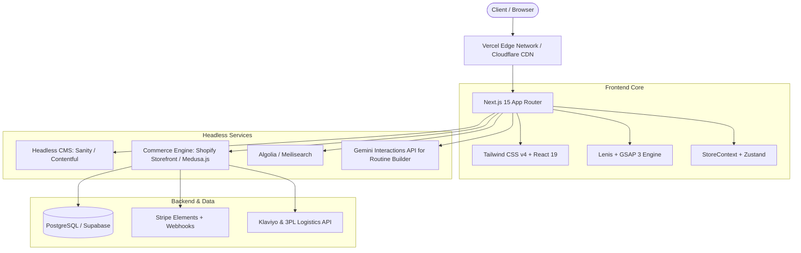

# Élanor — Technical Depth & Production Engineering Roadmap

> **System:** Élanor Luxury E-Commerce Platform  
> **Document Purpose:** Architecture blueprint, technical depth analysis, and production engineering roadmap for transition from prototype to production.

---

## 1. System Architecture Overview

---

## 2. Technical Depth & Engineering Workstreams

### 2.1 Backend & Commerce Engine Integration
* **Current Prototype State:** Local state machine (`StoreContext.tsx`) with in-memory catalog (`data/products.ts`) and simulated checkout.
* **Production Requirements:**
  1. **Headless Commerce Backend**:
     - Integrate with **Medusa.js** (open-source headless commerce) or **Shopify Storefront API** via GraphQL.
     - Implement server-side inventory locking and cart persistence across guest and authenticated user sessions.
  2. **Payment Gateway Integration**:
     - Replace simulated payment in `/checkout` with **Stripe Elements** (Apple Pay, Google Pay, credit card tokenization) or **Klarna/Afterpay** for luxury split payments.
     - Build secure Next.js Route Handlers (`app/api/checkout/route.ts`, `app/api/webhooks/stripe/route.ts`) with cryptographic signature validation.
  3. **Order Lifecycle & Customer Accounts**:
     - Customer authentication with NextAuth.js / Supabase Auth (magic link, Passkey/WebAuthn).
     - Customer order history, repeat subscription rituals ("Deliver every 30/60/90 days"), and saved payment methods.

---

### 2.2 Dynamic AI Routine Engine
* **Current Prototype State:** Algorithmic heuristic quiz mapping user selections to curated morning/evening sets.
* **Production Requirements:**
  1. **Gemini API Integration**:
     - Connect the diagnostic questionnaire to Google Gemini 2.0 Flash / Interactions API via edge route handler (`app/api/ai/diagnose/route.ts`).
     - Prompt engineering to ingest user-reported skin conditions, local UV index/pollution data (via geolocation), and allergy exclusions to output custom dosage recommendations and ingredient synergy explanations.
  2. **Structured JSON Output**:
     - Enforce `response_schema` in Gemini API calls for deterministic product pairing and clinical rationale.

---

### 2.3 Headless CMS & Content Localization
* **Current Prototype State:** Static TypeScript data files (`data/products.ts`, `data/concerns.ts`, `data/ingredients.ts`).
* **Production Requirements:**
  1. **Sanity.io / Strapi Schema**:
     - Schema definitions for Products, Ingredients, Clinical Trials, Editorial Articles, and Seasonal Campaigns.
     - Visual previews and live editing for marketing and dermatology copywriters.
  2. **Internationalization (i18n)**:
     - Next.js App Router localization support (`[locale]/...`) for French (`fr-FR`), English (`en-US`), and Japanese (`ja-JP`).
     - Currency conversion and localized tax calculation.

---

### 2.4 Performance, Image Optimization & Edge Caching
* **Current Prototype State:** Unoptimized image loading (`unoptimized: true` in `next.config.mjs`) for rapid local prototype development.
* **Production Requirements:**
  1. **Next.js Image Pipeline**:
     - Transition images to AVIF and WebP formats using `@vercel/og` or Cloudinary / Imgix with dynamic responsive blur placeholders (`blurDataURL`).
     - Responsive image `sizes` attribute on all high-density gallery images.
  2. **Caching Strategy**:
     - Incremental Static Regeneration (`revalidate = 3600`) for product pages and ingredient glossaries.
     - On-Demand Cache Revalidation triggered by CMS webhooks (`revalidateTag('products')`).

---

### 2.5 Security, Privacy & Compliance
* **Production Requirements:**
  1. **Content Security Policy (CSP)**:
     - Strict CSP headers configured in `middleware.ts` to prevent XSS and clickjacking.
  2. **GDPR / CCPA Compliance**:
     - Consent management banner for analytics cookies and customer marketing preferences.
     - Data deletion and export endpoints for compliance with EU privacy mandates.

---

### 2.6 Quality Assurance, Accessibility (a11y) & Testing
* **Production Requirements:**
  1. **Automated Testing Suite**:
     - **Unit Tests**: Vitest + React Testing Library for `StoreContext`, discount calculations, and form validation.
     - **End-to-End Tests**: Playwright tests for complete user journey (Add to cart → Checkout → Confirmation, AI Routine Quiz flow).
  2. **Accessibility Auditing**:
     - WCAG 2.1 AA compliance audit (color contrast on beige `#F8F3EB` surfaces, keyboard navigation for modal drawers, screen-reader ARIA live regions for cart counter updates).
  3. **CI/CD Pipeline**:
     - GitHub Actions workflow for linting, type-checking, automated test execution, and preview deployment to Vercel.

---

## 3. Engineering Work Packages & Priority Matrix

| Work Package | Complexity | Priority | Target Milestone |
|---|---|---|---|
| **Stripe Payment Gateway & Webhook Handlers** | Medium | P0 | Production Launch |
| **Headless Commerce Backend (Medusa/Shopify)** | High | P0 | Production Launch |
| **Gemini AI Diagnostic Edge Route** | Medium | P1 | Feature Expansion |
| **Sanity CMS Integration for Formulary & Ingredients** | Medium | P1 | Editorial Workflow |
| **Image CDN & AVIF Optimization Pipeline** | Low | P1 | Performance Milestone |
| **Customer Portal & Subscription Replenishment** | High | P2 | Retention Phase |
| **Playwright E2E Test Suite & CI/CD** | Medium | P1 | Quality Hardening |
